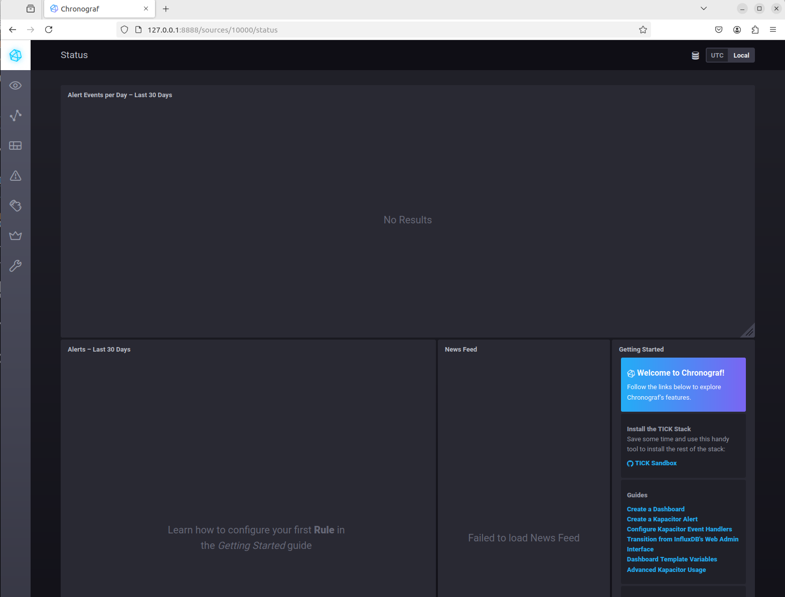
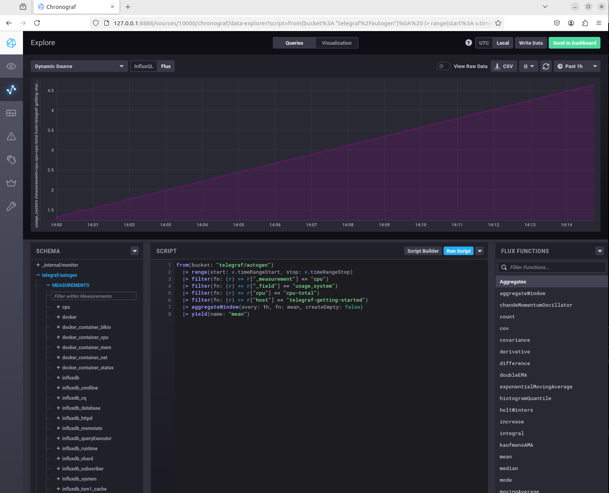
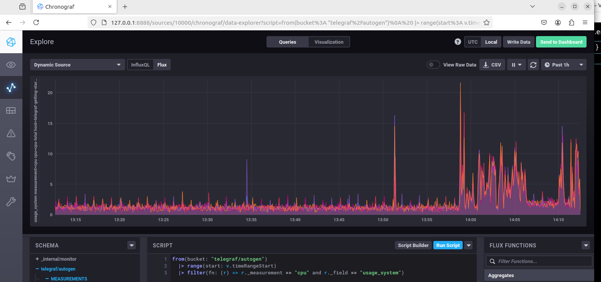

# Домашнее задание к занятию "13.Системы мониторинга"

## Обязательные задания

1. Вас пригласили настроить мониторинг на проект. На онбординге вам рассказали, что проект представляет из себя 
платформу для вычислений с выдачей текстовых отчетов, которые сохраняются на диск. Взаимодействие с платформой 
осуществляется по протоколу http. Также вам отметили, что вычисления загружают ЦПУ. Какой минимальный набор метрик вы
выведите в мониторинг и почему?
__Ответ:__

	Для HTTP минимальным набором метрик является:

	- время отклика (среднее, пиковое)

	- общее количество запросов (среднее, пиковое)

	- количество запросов, которые обрабатываются за секунду за последний интервал (requests per second) 

	- количество 4xx, 5xx ответов по отношению к общему количеству запросов (коэффициент ошибок)

#
2. Менеджер продукта посмотрев на ваши метрики сказал, что ему непонятно что такое RAM/inodes/CPUla. Также он сказал, 
что хочет понимать, насколько мы выполняем свои обязанности перед клиентами и какое качество обслуживания. Что вы 
можете ему предложить?
__Ответ:__
Для менеджера продукта, которому важнее видеть показатели качества обслуживания и выполнения обязательств перед клиентами, можно представить метрики на более высоком уровне абстракции, чтобы они были понятнее и соответствовали бизнес-целям.

- SLO. Целевой уровень качества обслуживания. Целевое значение или диапазон значений.
- SLA. Соглашение об уровне обслуживания. Явный или неявный контракт с внешними пользователями, включающий в себя последствия невыполнения SLO.
- SLI. Индикатор качества обслуживания. Конкретная величина предоставляемого обслуживания.
#
3. Вашей DevOps команде в этом году не выделили финансирование на построение системы сбора логов. Разработчики в свою 
очередь хотят видеть все ошибки, которые выдают их приложения. Какое решение вы можете предпринять в этой ситуации, 
чтобы разработчики получали ошибки приложения?
__Ответ:__
Можно настроить сбор логов на уровне приложений, использовать бесплатные инструменты для сбора и анализа логов, организовать систему агрегации логов через доступные каналы связи.
#
4. Вы, как опытный SRE, сделали мониторинг, куда вывели отображения выполнения SLA=99% по http кодам ответов. 
Вычисляете этот параметр по следующей формуле: summ_2xx_requests/summ_all_requests. Данный параметр не поднимается выше 
70%, но при этом в вашей системе нет кодов ответа 5xx и 4xx. Где у вас ошибка?
__Ответ:__
Если процент выполнения SLA остаётся на уровне 70%, но в системе отсутствуют коды ответов 4xx и 5xx, то это указывает на возможное наличие других типов ответов, которые не попадают в категорию успешных ответов, но также не являются ошибками.

Чаще всего это ответы с кодами:

-1xx (информационные ответы): Включают коды вроде 100 (Continue) или 101 (Switching Protocols), которые могут занимать значительную часть запросов, особенно если в системе активно используются веб-сокеты или другие длительные соединения.
-3xx (редиректы): Коды редиректов, такие как 301, 302 или 307, также не считаются ошибками, но не попадают в категорию успешных ответов.
#
5. Опишите основные плюсы и минусы pull и push систем мониторинга.
__Ответ:__
Плюсы:

Контроль за опросом: Сервер мониторинга контролирует интервал сбора метрик, что позволяет избежать перегрузки сети и серверов.
Непрерывный мониторинг: В случае проблем с узлом или сетью сервер мониторинга легко обнаруживает, что узел не отвечает, и может быстро сигнализировать об этом.
Гибкость в получении данных: Можно настроить сбор метрик с разными интервалами и уровнями детализации для различных систем. 
Минусы:
Проблемы с масштабируемостью: При большом количестве наблюдаемых узлов серверу мониторинга может быть сложно справляться с потоком запросов и поддерживать частоту опроса.
Ограничение на типы сетей: Система работает только если сервер мониторинга имеет доступ ко всем узлам. Например, мониторинг сложно настроить в условиях закрытых сетей или NAT, где сервер не может напрямую подключаться к клиентам.

Push-система мониторинга

Плюсы:

Хорошая масштабируемость: Каждое приложение отправляет данные самостоятельно, что снижает нагрузку на центральный сервер и позволяет легко добавлять новые узлы или сервисы без перенастройки сервера.
Удобно для распределённых систем: Push-подход позволяет легко интегрировать системы, работающие в разных сетях и за NAT, поскольку данные поступают от клиентов на сервер мониторинга.
Гибкий контроль интервалов отправки: Каждое приложение может настроить свой интервал отправки метрик, что позволяет оптимизировать частоту обновлений для разных сервисов.
Подходит для нестабильных систем: Push-системы удобны для отслеживания краткоживущих или динамически меняющихся сервисов. 
Минусы:
Сложность обеспечения надёжности данных: В случае сбоев в приложении метрики могут не отправляться, и сервер не узнает о проблеме.
Необходимость дополнительной безопасности: Сервер мониторинга должен быть доступен для всех отправителей, что требует продуманной настройки безопасности и аутентификации для предотвращения несанкционированной передачи данных.
Повышенная сложность настройки: Требуется дополнительная настройка на каждом наблюдаемом узле для отправки метрик.
#
6. Какие из ниже перечисленных систем относятся к push модели, а какие к pull? А может есть гибридные?

    - Prometheus - гибридая, но в основном pull
    - TICK - Push
    - Zabbix - гибридная
    - VictoriaMetrics - pull
    - Nagios- pull, но можно через плагины Push
#
7. Склонируйте себе [репозиторий](https://github.com/influxdata/sandbox/tree/master) и запустите TICK-стэк, 
используя технологии docker и docker-compose.

В виде решения на это упражнение приведите скриншот веб-интерфейса ПО chronograf (`http://localhost:8888`). 

P.S.: если при запуске некоторые контейнеры будут падать с ошибкой - проставьте им режим `Z`, например
`./data:/var/lib:Z`

#
8. Перейдите в веб-интерфейс Chronograf (http://localhost:8888) и откройте вкладку Data explorer.
        
    - Нажмите на кнопку Add a query
    - Изучите вывод интерфейса и выберите БД telegraf.autogen
    - В `measurments` выберите cpu->host->telegraf-getting-started, а в `fields` выберите usage_system. Внизу появится график утилизации cpu.
    - Вверху вы можете увидеть запрос, аналогичный SQL-синтаксису. Поэкспериментируйте с запросом, попробуйте изменить группировку и интервал наблюдений.
    


Для выполнения задания приведите скриншот с отображением метрик утилизации cpu из веб-интерфейса.
#
9. Изучите список [telegraf inputs](https://github.com/influxdata/telegraf/tree/master/plugins/inputs). 
Добавьте в конфигурацию telegraf следующий плагин - [docker](https://github.com/influxdata/telegraf/tree/master/plugins/inputs/docker):
```
[[inputs.docker]]
  endpoint = "unix:///var/run/docker.sock"
```

Дополнительно вам может потребоваться донастройка контейнера telegraf в `docker-compose.yml` дополнительного volume и 
режима privileged:
```
  telegraf:
    image: telegraf:1.4.0
    privileged: true
    volumes:
      - ./etc/telegraf.conf:/etc/telegraf/telegraf.conf:Z
      - /var/run/docker.sock:/var/run/docker.sock:Z
    links:
      - influxdb
    ports:
      - "8092:8092/udp"
      - "8094:8094"
      - "8125:8125/udp"
```

После настройке перезапустите telegraf, обновите веб интерфейс и приведите скриншотом список `measurments` в 
веб-интерфейсе базы telegraf.autogen . Там должны появиться метрики, связанные с docker.

Факультативно можете изучить какие метрики собирает telegraf после выполнения данного задания.

## Дополнительное задание (со звездочкой*) - необязательно к выполнению

1. Вы устроились на работу в стартап. На данный момент у вас нет возможности развернуть полноценную систему 
мониторинга, и вы решили самостоятельно написать простой python3-скрипт для сбора основных метрик сервера. Вы, как 
опытный системный-администратор, знаете, что системная информация сервера лежит в директории `/proc`. 
Также, вы знаете, что в системе Linux есть  планировщик задач cron, который может запускать задачи по расписанию.

Суммировав все, вы спроектировали приложение, которое:
- является python3 скриптом
- собирает метрики из папки `/proc`
- складывает метрики в файл 'YY-MM-DD-awesome-monitoring.log' в директорию /var/log 
(YY - год, MM - месяц, DD - день)
- каждый сбор метрик складывается в виде json-строки, в виде:
  + timestamp (временная метка, int, unixtimestamp)
  + metric_1 (метрика 1)
  + metric_2 (метрика 2)
  
     ...
     
  + metric_N (метрика N)
  
- сбор метрик происходит каждую 1 минуту по cron-расписанию

Для успешного выполнения задания нужно привести:

а) работающий код python3-скрипта,

б) конфигурацию cron-расписания,

в) пример верно сформированного 'YY-MM-DD-awesome-monitoring.log', имеющий не менее 5 записей,

P.S.: количество собираемых метрик должно быть не менее 4-х.
P.P.S.: по желанию можно себя не ограничивать только сбором метрик из `/proc`.

2. В веб-интерфейсе откройте вкладку `Dashboards`. Попробуйте создать свой dashboard с отображением:

    - утилизации ЦПУ
    - количества использованного RAM
    - утилизации пространства на дисках
    - количество поднятых контейнеров
    - аптайм
    - ...
    - фантазируйте)
    
    ---

### Как оформить ДЗ?

Выполненное домашнее задание пришлите ссылкой на .md-файл в вашем репозитории.

---

